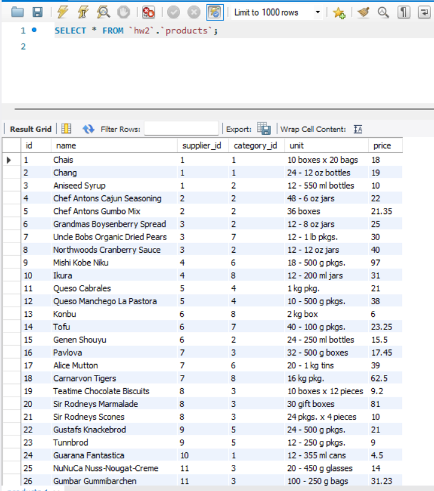
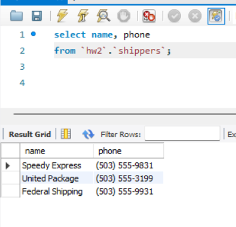
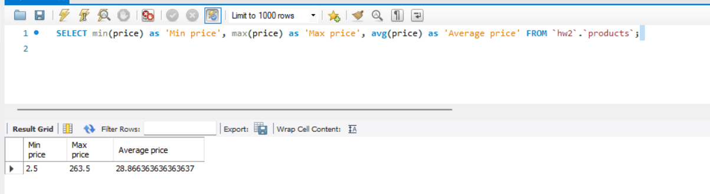
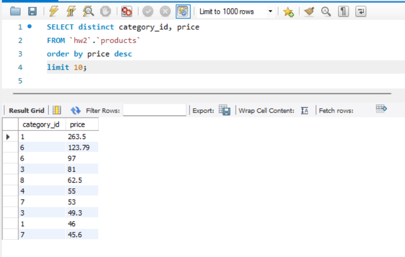
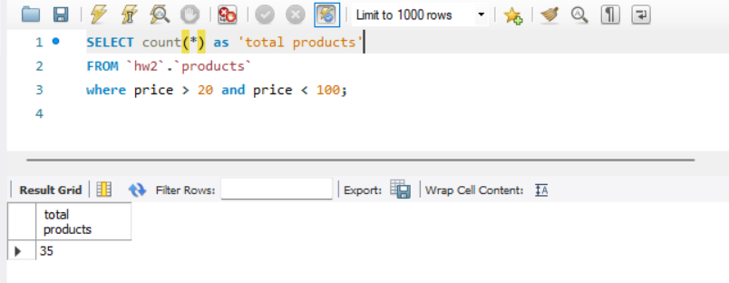
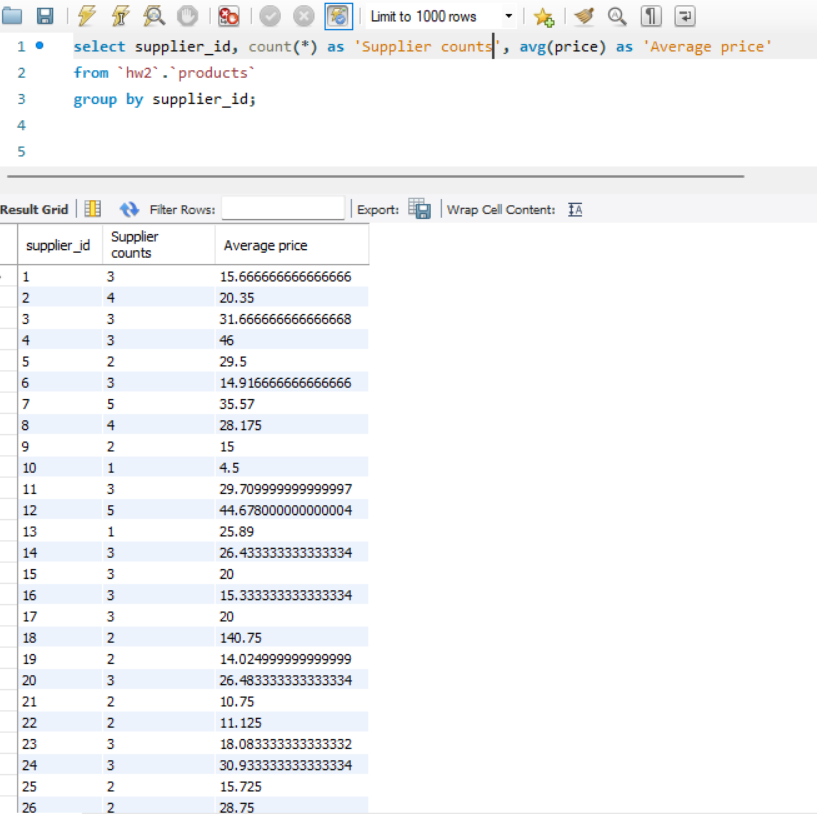

# DQL commands (HW2)

## Content

- [Task1](#Task1)
- [Task1-1](#Task1-1)
- [Task1-2](#Task1-2)
- [Task3](#Task3)
- [Task4](#Task4)
- [Task5](#Task5)

## Task1

Write an SQL command that allows you to:

## Task1-1

- select all columns (Using the wildcard “\*”) from the products table;

SQL queries:

``` mysql 
    SELECT * FROM `hw2`.`products`; 
```



## Task1-2

- select only the name, phone columns from the shippers table,

SQL queries:

```mysql
    SELECT name, phone
    FROM `hw2`.`shippers`;
```



## Task2

Write an SQL command that can be used to find the average, maximum, and minimum value of the price column of the products table.

SQL queries:

```mysql
    SELECT min(price) as 'Min price', max(price) as 'Max price', avg(price) as 'Average price'
    FROM `hw2`.`products`;
```



## Task3

Write an SQL command that can be used to select the unique values ​​of the category_id and price columns of the products table.

Select the display order in descending order of price and select only 10 rows.

SQL queries:

```mysql
    SELECT distinct category_id, price
    FROM `hw2`.`products`
    ORDER BY price desc
    LIMIT 10;
```



## Task4

Write an SQL command that can be used to find the number of products (rows) that are in the price range from 20 to 100.

SQL queries:

```mysql
    SELECT count(*) as 'total products'
    FROM `hw2`.`products`
    WHERE price > 20 and price < 100;
```



## Task5

Write an SQL command that can be used to find the number of products (rows) and the average price (price) from each supplier (supplier_id).

SQL queries:

```mysql
    SELECT supplier_id, count(*) as 'Supplier counts', avg(price) as 'Average price'
    FROM `hw2`.`products`
    GROUP BY supplier_id;
```


